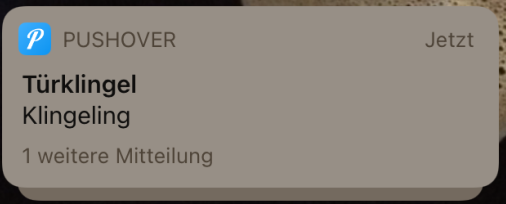

# DOSE (DOor SEnsor)

Dose is a small IoT project which notifies you in case the doorbell is ringing.
Notification will be sent via [Pushover](https://pushover.net/)

## Wiring

## Example

## Parts

* [ESP8266](https://www.aliexpress.com/wholesale?SearchText=esp8266+nodemcu+v3+)
* [KY-038](https://www.aliexpress.com/wholesale?SearchText=KY-038)

## HowTo

Compile and upload with ArduinoIDE (or whatever you prefer).
Beforehand you have to install this [Pushover lib](https://github.com/ArduinoHannover/Pushover)

## Thanks to

* [Pushover lib](https://github.com/ArduinoHannover/Pushover)
* [the internet](https://thibmaek.com/post/detecting-sound-level-using-esp8266-and-esphome)
* [another internet](https://diyi0t.com/sound-sensor-arduino-esp8266-esp32/)
* [Maza Pita](https://mazapita.de/) for lunch during LockDown :falafel:
